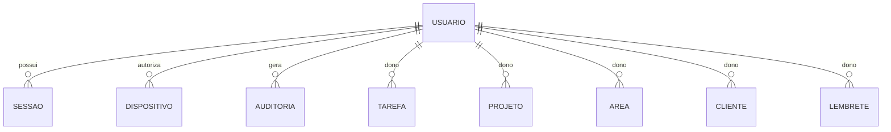
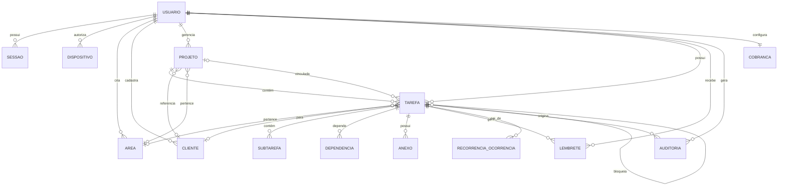

# 01 — Modelo de Domínio

> **Vinculante.** Precedência #1 (documento da Fase 1).
> Sem código de produto. Define classes, invariantes, regras de negócio e ciclo de vida.

---

## 1. Princípios

- **Java records** para DTOs imutáveis de transporte (entrada/saída de `core/`).
- **Classes de domínio mutáveis** (entidades com `versao`, `atualizado_em`) com **lombok `@Value`** ou `final` + setters explícitos quando necessário.
- **Enums** para estados e níveis (não strings em banco).
- **Invariantes** declaradas em método `validar()` da própria entidade. **Falha = exceção de domínio** (não `IllegalStateException` genérico).
- **Funções de `core/` puras**: primeiro parâmetro é `DataSource` (servidor) ou `Connection` (cliente offline). Sem dependência de UI, sem estático mutável.

## 2. Pacotes

```
app.mllopes.gestor
├── App.java                           ← JavaFX Application (cliente)
├── core/
│   ├── domain/                        ← records e classes de domínio
│   │   ├── Tarefa.java
│   │   ├── Subtarefa.java
│   │   ├── Projeto.java
│   │   ├── Cliente.java
│   │   ├── Area.java
│   │   ├── Lembrete.java
│   │   ├── Recorrencia.java
│   │   ├── Dispositivo.java
│   │   ├── Sessao.java
│   │   ├── Usuario.java
│   │   ├── Anexo.java
│   │   ├── Auditoria.java
│   │   ├── Cobranca.java
│   │   └── enums/                     ← Status, Prioridade, NivelCobranca, AcaoNotificacao
│   ├── repo/                          ← acesso a dados (PreparedStatement)
│   │   ├── TarefaRepo.java
│   │   ├── ProjetoRepo.java
│   │   └── ...
│   ├── service/                       ← regra de negócio (orquestra repos)
│   │   ├── TarefaService.java
│   │   ├── CobrancaService.java
│   │   ├── RecorrenciaService.java
│   │   └── ...
│   └── util/
│       ├── Ulid.java                  ← wrapper de ulid-creator
│       ├── Horario.java               ← fuso + recorrência + DST
│       ├── HashUtil.java              ← SHA-256
│       └── Result.java                ← {ok, dados, erro} (em vez de exceção para falhas esperadas)
├── db/
│   ├── Db.java                        ← HikariDataSource / Connection wrapper
│   ├── FlywayRunner.java              ← roda migrations no boot
│   └── Pragmas.java                   ← PRAGMAs obrigatórios
├── sync/
│   ├── SyncFila.java                  ← fila local persistente
│   ├── SyncEngine.java                ← empurrar/puxar, retry, backoff
│   ├── ConflitoResolver.java          ← política por campo
│   └── SseClient.java                 ← cliente SSE para desktop
├── notifications/
│   ├── Notificador.java               ← fachada
│   ├── WinRtNotificador.java          ← JNA + AppNotificationManager
│   ├── AwtTrayNotificador.java        ← fallback java.awt.SystemTray
│   ├── FilaNotificacoes.java          ← tabela local de notificações
│   └── acoes/
│       ├── ConcluirAcao.java
│       ├── AdiarAcao.java
│       ├── BloquearAcao.java
│       └── CancelarAcao.java
├── ai/                                ← stub: será preenchido na Fase 6
├── ui/
│   ├── MainController.java
│   ├── HojeController.java
│   ├── TarefaDetalheController.java
│   └── ...
├── tray/
│   ├── Bandeja.java                   ← SystemTray
│   └── MenuBandeja.java
├── update/
│   ├── Atualizador.java               ← checa versão + baixa + valida + instala
│   └── HashValidador.java
└── observability/
    ├── AppLogger.java                 ← SLF4J + Logback configurado
    └── CorrelationId.java             ← MDC
```

> No servidor, o pacote raiz é `app.mllopes.gestor.api` e o `core/` é espelhado (mesmas classes de domínio, mesmas regras). Cada `*Service` do servidor pode ser uma versão "central" (com mais permissões e telemetria) do que roda no cliente.

## 3. Identidade, autenticação e sessão



### 3.1 `Usuario`

| Campo | Tipo | Notas |
|---|---|---|
| `id` | ULID | PK |
| `email` | String | UNIQUE, validado regex |
| `senha_hash` | String | argon2id (de.mkammerer) |
| `nome` | String | 1-120 chars |
| `fuso` | `ZoneId` | default `America/Sao_Paulo` |
| `horario_trabalho_inicio` | LocalTime | default 08:00 |
| `horario_trabalho_fim` | LocalTime | default 18:00 |
| `dias_trabalho` | Set\<DayOfWeek\> | default Seg-Sex |
| `politica_cobranca` | JSON | ver `CobrancaService` |
| `ia_habilitada` | boolean | default true |
| `tom_cobranca` | enum {PROFISSIONAL, FIRME, GENTIL} | default PROFISSIONAL |
| `criado_em` | Instant | UTC |
| `atualizado_em` | Instant | UTC |
| `versao` | long | LWW |
| `dono_id` | ULID | = `id` (singleton) |

**Invariantes**:
- `email` validado regex `^[A-Za-z0-9._%+-]+@[A-Za-z0-9.-]+\.[A-Za-z]{2,}$`.
- `horario_trabalho_inicio != horario_trabalho_fim`.
- `politica_cobranca` validada por schema JSON.

### 3.2 `Sessao`

| Campo | Tipo |
|---|---|
| `id` | ULID |
| `usuario_id` | ULID FK |
| `token_hash` | String (SHA-256 do token cookie) |
| `criada_em` | Instant |
| `expira_em` | Instant (sessão oca: 24h) |
| `revogada_em` | Instant? |
| `dispositivo_id` | ULID FK |
| `ip_criacao` | String |
| `user_agent` | String |

**Invariantes**:
- Token é gerado via `SecureRandom` (256 bits), **nunca** persistido em claro.
- `token_hash = SHA-256(token)`.
- Cookie tem `httpOnly`, `SameSite=Lax`, `Secure` (em prod), `Path=/`.
- Renovação por atividade: cada request estende `expira_em` em 24h (sliding).
- Revogação: marca `revogada_em`; próxima request com esse token → 401 + cookie limpo.

### 3.3 `Dispositivo`

| Campo | Tipo |
|---|---|
| `id` | ULID |
| `usuario_id` | ULID FK |
| `nome` | String (ex: "Lopes — Desktop Escritório") |
| `sistema` | String (ex: "Windows 11 Pro 23H2") |
| `app_versao` | String (semver) |
| `ultimo_acesso_em` | Instant |
| `criado_em` | Instant |
| `revogado_em` | Instant? |

**Invariantes**:
- Mesmo `usuario_id` pode ter N dispositivos, mas o cadastro automático ocorre no primeiro login com novo fingerprint (nome do host + SO + versão app).
- Usuário pode revogar via tela Configurações → Dispositivos. Revogação **invalida todas as sessões** daquele dispositivo.

## 4. Áreas, clientes, projetos

### 4.1 `Area`

| Campo | Tipo |
|---|---|
| `id` | ULID |
| `usuario_id` | ULID |
| `nome` | String (1-60) |
| `cor` | String (hex `#RRGGBB`) |
| `ordem` | int (para sort) |
| `versao` | long |

**Invariante**: `nome` único por `(usuario_id, lower(nome))`.

### 4.2 `Cliente`

| Campo | Tipo |
|---|---|
| `id` | ULID |
| `usuario_id` | ULID |
| `nome` | String (1-120) |
| `organizacao` | String? (1-200) |
| `contatos_json` | JSON `{email, telefone, telegram, ...}` |
| `observacoes` | String? |
| `status` | enum {ATIVO, INATIVO, ARQUIVADO} |
| `versao` | long |

**Invariante**: pelo menos `nome` ou `organizacao` não-vazio.

### 4.3 `Projeto`

| Campo | Tipo |
|---|---|
| `id` | ULID |
| `usuario_id` | ULID |
| `titulo` | String (1-200) |
| `descricao` | String? |
| `cliente_id` | ULID? FK |
| `area_id` | ULID? FK |
| `status` | enum {PLANEJADO, EM_ANDAMENTO, PAUSADO, CONCLUIDO, CANCELADO, ARQUIVADO} |
| `prioridade` | enum ver §5 |
| `inicio_em` | LocalDate? |
| `fim_em` | LocalDate? |
| `progresso_calc` | double (0.0-1.0, **calculado**, persistido para performance) |
| `participantes_json` | JSON array (futuro, multiusuário) |
| `versao` | long |

**Invariante**:
- `fim_em >= inicio_em` quando ambos presentes.
- `progresso_calc` é sempre recalculado a partir das tarefas filhas no `ProjetoService.recalcularProgresso(id)`.

## 5. Tarefa (núcleo)

### 5.1 Enums

```java
public enum Status {
    CAIXA_ENTRADA,
    PLANEJADA,
    EM_ANDAMENTO,
    AGUARDANDO_TERCEIRO,
    BLOQUEADA,
    EM_REVISAO,
    ENTREGUE_AGUARDANDO_CONFIRMACAO,
    CONCLUIDA,
    ADIADA,
    CANCELADA,
    ARQUIVADA
}

public enum Prioridade { BAIXA, NORMAL, ALTA, URGENTE, CRITICA }

public enum NivelCobranca { DISCRETA, PERSISTENTE, INTENSIVA, CRITICA }
```

### 5.2 `Tarefa`

| Campo | Tipo | Default | Notas |
|---|---|---|---|
| `id` | ULID | — | PK |
| `usuario_id` | ULID | — | FK |
| `titulo` | String | — | 1-200 |
| `descricao` | String? | null | markdown permitido |
| `area_id` | ULID? | null | FK |
| `projeto_id` | ULID? | null | FK |
| `cliente_id` | ULID? | null | FK |
| `status` | enum | CAIXA_ENTRADA | |
| `prioridade` | enum | NORMAL | |
| `nivel_cobranca` | enum | PERSISTENTE | |
| `inicio_em` | Instant? | null | UTC |
| `vencimento_em` | Instant? | null | UTC |
| `duracao_estimada_min` | int? | null | > 0 |
| `duracao_realizada_min` | int | 0 | ≥ 0 |
| `recorrencia_json` | String? | null | ver `Recorrencia` |
| `etiquetas_json` | JSON array | `[]` | OR-Set |
| `responsavel` | String? | null | futuro, multiusuário |
| `origem` | enum | MANUAL | {MANUAL, NL, IMPORTADA, EMAIL, OUTRO} |
| `concluida_em` | Instant? | null | UTC |
| `entregue_em` | Instant? | null | UTC |
| `confirmada_em` | Instant? | null | UTC |
| `motivo_cancelamento` | String? | null | obrigatório se `status=CANCELADA` |
| `motivo_adiamento` | String? | null | obrigatório se tarefa vencida foi adiada |
| `criado_em` | Instant | — | UTC |
| `atualizado_em` | Instant | — | UTC |
| `versao` | long | 1 | LWW |
| `cliente_origem` | ULID | — | id do dispositivo que criou |
| `dono_id` | ULID | — | = `usuario_id` (multi-tenant-ready) |

**Invariantes** (validadas em `Tarefa.validar()`):
1. `titulo` não vazio, ≤ 200 chars.
2. Se `status=CONCLUIDA` → `concluida_em` não nulo.
3. Se `status=ENTREGUE_AGUARDANDO_CONFIRMACAO` → `entregue_em` não nulo, `concluida_em` pode ser nulo.
4. Se `status=CANCELADA` → `motivo_cancelamento` não vazio.
5. Se `status=ADIADA` e `vencimento_em` já passou → `motivo_adiamento` não vazio.
6. Se `vencimento_em` presente → `> criado_em`.
7. Se `duracao_estimada_min` presente → `> 0`.
8. `duracao_realizada_min ≥ 0`.
9. Não pode ter `recorrencia_json` E `projeto_id` ambos (recorrência é individual).
10. Transições de status controladas por matriz (ver §5.3).

### 5.3 Matriz de transições de status

| De ↓ / Para → | CAIXA_ENTRADA | PLANEJADA | EM_ANDAMENTO | AGUARDANDO_TERCEIRO | BLOQUEADA | EM_REVISAO | ENTREGUE_AGUARDANDO_CONFIRMACAO | CONCLUIDA | ADIADA | CANCELADA | ARQUIVADA |
|---|---|---|---|---|---|---|---|---|---|---|---|
| CAIXA_ENTRADA | — | ✓ | ✓ | ✓ | ✓ | ✗ | ✗ | ✓ (com aviso) | ✓ | ✓ | ✓ |
| PLANEJADA | ✗ | — | ✓ | ✓ | ✓ | ✓ | ✗ | ✓ | ✓ | ✓ | ✓ |
| EM_ANDAMENTO | ✗ | ✓ | — | ✓ | ✓ | ✓ | ✓ | ✓ | ✓ (c/ motivo) | ✓ (c/ motivo) | ✓ |
| AGUARDANDO_TERCEIRO | ✗ | ✓ | ✓ | — | ✓ | ✓ | ✗ | ✓ | ✓ | ✓ | ✓ |
| BLOQUEADA | ✗ | ✓ | ✓ | ✓ | — | ✗ | ✗ | ✓ | ✓ | ✓ | ✓ |
| EM_REVISAO | ✗ | ✓ | ✓ | ✗ | ✗ | — | ✓ | ✓ | ✓ | ✓ | ✓ |
| ENTREGUE_AGUARDANDO_CONFIRMACAO | ✗ | ✗ | ✗ | ✗ | ✗ | ✓ | — | ✓ | ✗ | ✓ (c/ motivo) | ✓ |
| CONCLUIDA | ✗ | ✗ | ✓ (reabrir) | ✗ | ✗ | ✗ | ✗ | — | ✗ | ✗ | ✓ |
| ADIADA | ✗ | ✓ | ✓ | ✓ | ✓ | ✓ | ✗ | ✓ | — | ✓ | ✓ |
| CANCELADA | ✗ | ✗ | ✗ | ✗ | ✗ | ✗ | ✗ | ✗ | ✗ | — | ✓ |
| ARQUIVADA | ✗ | ✗ | ✗ | ✗ | ✗ | ✗ | ✗ | ✗ | ✗ | ✗ | — |

Reabrir `CONCLUIDA` é permitido e **preserva histórico** (ver §6).

### 5.4 Recorrência

```java
public record Recorrencia(
    Frequencia frequencia,   // DIARIA, SEMANAL, MENSAL, ANUAL, PERSONALIZADA
    int intervalo,           // a cada N unidades
    DayOfWeek[] diasSemana,  // só SEMANAL
    int[] diasMes,           // só MENSAL (1-31)
    LocalTime horario,       // hora preferida de geração
    Instant terminaEm,       // null = sem fim
    int ocorrenciasGeradas,
    int ocorrenciasMaximas   // null = sem teto
) {}
```

**Invariantes**:
- `intervalo ≥ 1`.
- `frequencia=DIARIA → diasSemana/diasMes null`.
- `frequencia=SEMANAL → diasSemana não vazio`.
- `frequencia=MENSAL → diasMes não vazio, valores 1-31`.
- `horario` respeita fuso do usuário (calculado em UTC para armazenamento).

### 5.5 Subtarefa e checklist

`Subtarefa`:

| Campo | Tipo |
|---|---|
| `id` | ULID |
| `tarefa_id` | ULID FK |
| `titulo` | String |
| `ordem` | int |
| `concluida_em` | Instant? |
| `versao` | long |

**Invariante**: `ordem ≥ 0`, reordenação preserva unicidade por `(tarefa_id, ordem)`.

### 5.6 Dependência

`Dependencia`:

| Campo | Tipo |
|---|---|
| `tarefa_id` | ULID (PK) |
| `depende_de_id` | ULID (PK) |
| `tipo` | enum {BLOQUEIA, INFORMA} |

**Invariante**: `tarefa_id != depende_de_id` (sem auto-dependência). Detecção de ciclo no `TarefaService.criarDependencia` (BFS).

### 5.7 Anexo

`Anexo`:

| Campo | Tipo |
|---|---|
| `id` | ULID |
| `tarefa_id` | ULID FK |
| `caminho_local` | String? |
| `url_externa` | String? |
| `mime` | String |
| `tamanho_bytes` | long |
| `sha256` | String (hex) |
| `criado_em` | Instant |
| `versao` | long |

**Invariante**: XOR entre `caminho_local` e `url_externa` (um, e só um, não nulo).

## 6. Auditoria

`Auditoria` (append-only):

| Campo | Tipo |
|---|---|
| `id` | ULID |
| `usuario_id` | ULID |
| `entidade` | String (nome da tabela) |
| `entidade_id` | ULID |
| `acao` | String (ver lista) |
| `diff_json` | JSON (antes/depois) |
| `dispositivo_id` | ULID? |
| `em` | Instant |

**Ações registradas** (mínimo):
- `criada`, `editada`, `status_alterado`, `prazo_alterado`, `concluida`, `reaberta`, `cancelada`, `adiada`, `prioridade_alterada`, `cliente_alterado`
- `sync_empurrada`, `sync_puxada`, `conflito_resolvido`
- `notificacao_enviada`, `notificacao_acao`, `notificacao_falhou`
- `login`, `logout`, `dispositivo_registrado`, `dispositivo_revogado`
- `backup_criado`, `backup_restaurado`, `exportacao_dados`
- `conta_apagada_solicitada`, `conta_apagada_confirmada`

**Reabrir CONCLUIDA**: `Auditoria` registra `acao=reaberta, diff_json={status_antigo: CONCLUIDA, status_novo: EM_ANDAMENTO, motivo}`.

## 7. Cobrança e lembretes

### 7.1 `Lembrete`

| Campo | Tipo |
|---|---|
| `id` | ULID |
| `tarefa_id` | ULID FK |
| `momento` | Instant (UTC) |
| `canal` | enum {WINDOWS_LOCAL, EMAIL, TELEGRAM, WHATSAPP, WEB_PUSH} |
| `recorrencia_json` | String? (reenvio da notificação se não tratada) |
| `estado` | enum {PENDENTE, ENFILEIRADO, ENTREGUE, CONFIRMADO, FALHOU, CANCELADO} |
| `tentativas` | int |
| `ultimo_erro` | String? |
| `criado_em` | Instant |
| `versao` | long |

### 7.2 `Cobranca` (configuração por usuário)

```java
public record Cobranca(
    Map<NivelCobranca, PoliticaNivel> politicas,
    TomCobranca tom,
    boolean silenciarForaHorario,
    Set<DayOfWeek> diasTrabalho,
    LocalTime inicioTrabalho,
    LocalTime fimTrabalho
) {}

public record PoliticaNivel(
    int[] antecedenciaMinutos,         // ex: {240, 120, 60, 30} antes do vencimento
    int[] intervaloRepeticaoMinutos,   // ex: {30, 30, 30} após vencimento
    int maxRepeticoes,                 // -1 = até decisão
    boolean requerMotivoAdiar,
    boolean requerMotivoCancelar
) {}
```

**Default por nível**:

| Nível | Antecedência | Repetição | Max | Motivo adiar | Motivo cancelar |
|---|---|---|---|---|---|
| DISCRETA | 60 | — | 0 | não | sim |
| PERSISTENTE | 120, 60, 30, 0, +30 | 30 | 5 | sim | sim |
| INTENSIVA | 240, 120, 60, 30, 0, +15, +60 | 15 | 20 | sim | sim |
| CRITICA | 480, 240, 120, 60, 30, 0, +10, +30, +60, +120 | 10 | -1 | sim | sim |

## 8. Ciclos de vida completos

### 8.1 Criação

```
[Nova Tarefa]
   │
   ├─ caixa de entrada (1 texto) → status=CAIXA_ENTRADA, nivel=PERSISTENTE
   ├─ cadastro completo → status=PLANEJADA, nivel=configurável
   └─ NL interpretada (Fase 6) → confirmada pelo usuário → status=PLANEJADA
```

### 8.2 Conclusão

```
[Em andamento] → ação "concluir" → [Concluída]
   ├─ registra autor, dispositivo, horario (auditoria)
   ├─ se recorrente: dispara RecorrenciaService.gerarProxima()
   └─ notifica confirmação (se aplicável)
```

### 8.3 Reabertura

```
[Concluída] → ação "reabrir" → [Em andamento]
   ├─ mantém todo o histórico em auditoria
   └─ reabrir exige motivo (campo `motivo_reabertura` no log)
```

### 8.4 Cancelamento

```
[Qualquer status não-terminal] → "cancelar" + motivo (obrigatório) → [Cancelada]
```

### 8.5 Adiar

```
[Qualquer status aberto] → "adiar" + nova data + motivo (se vencida) → [Adiada]
   └─ gera evento Lembrete para nova data
```

## 9. Diagrama ER completo



## 10. Princípios de cálculo

- **`progresso_calc` do projeto** = `tarefas_concluidas / total_tarefas` (exclui canceladas e arquivadas). Recalculado a cada mudança de status de tarefa filha.
- **`taxa_conclusao` por usuário/período** = `concluidas / criadas` em janela.
- **`atrasadas`** = `status NOT IN (CONCLUIDA, CANCELADA, ARQUIVADA) AND vencimento_em < agora()`.
- **`carregadas_por_dia`** = soma de `duracao_estimada_min` das tarefas com `vencimento_em` no dia / 60.

## 11. Cross-references

- Schema físico: `02-MODELO-DADOS.md`.
- Contratos de API (Tarefa, etc.): `03-CONTRATOS-API.md`.
- Sincronização e política por campo: `04-POLITICA-SYNC.md`.
- Motor de cobrança: `06-ESTRATEGIA-NOTIFICACOES.md`.
- Identidade imutável: `AGENTS.md` §1.
- ADRs: 0001 (stack), 0003 (banco), 0005 (notificações).

---

*ML Lopes Design · Marcio · mlopesdesign@gmail.com*
*Fase 1 — Especificação e arquitetura — 14/08/2026.*
