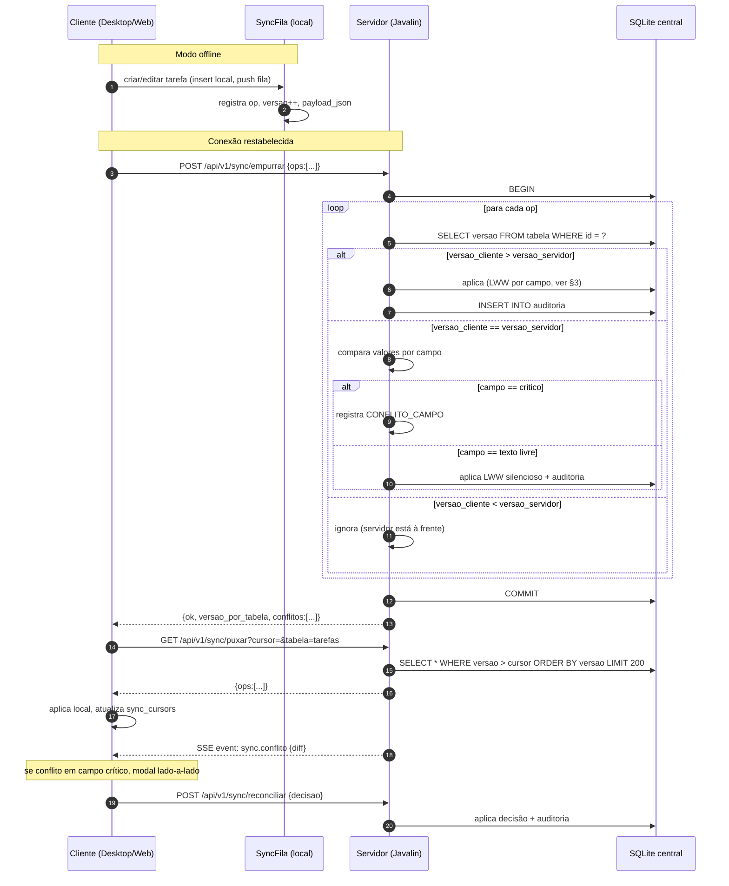

# 04 — Política de Sincronização

> **Vinculante.** Precedência #1 (documento da Fase 1).
> Sem código de produto. Define como dois ou mais dispositivos trocam dados sem perda silenciosa e sem LWW indiscriminado.
> Endurece o ADR 0002 com política explícita por campo e detecção de conflito visível ao usuário.

---

## 1. Princípios (do padrão ML Lopes §1, §3.5, §4.2 e do PROJETO §14)

1. **Offline é o normal.** A fila local existe por padrão.
2. **LWW é o último recurso**, nunca o padrão. Conflito em campo crítico abre UI.
3. **Idempotência total**: `(id, versao)` define univocamente uma versão.
4. **Sem sobrescrita silenciosa.** Qualquer divergência de campo fica visível (UI ou auditoria).
5. **Sync é otimização**, não pré-requisito para usar o produto.
6. **Detecção é determinística** por ULID do dispositivo, sem depender de relógio de parede.
7. **Tombstones** (não DELETE físico) por 30 dias para resolver deleção concorrente.

## 2. Modelo de concorrência

### 2.1 Identificadores

| Identificador | Geração | Uso |
|---|---|---|
| `id` da entidade | ULID (26 chars) | Identidade da linha; nunca muda |
| `versao` | inteiro monotônico local | LWW; incrementada a cada update local |
| `cliente_origem` | ULID do dispositivo | Tiebreaker em conflito; não usa wall clock |
| `dono_id` | ULID do usuário | Multi-tenant-ready; filtro de partição |

### 2.2 Tiebreaker (sem wall clock!)

Quando duas operações têm a mesma `versao` (conflito simétrico), o desempate é por **ordenação do ULID `cliente_origem`** (string compare). **Não** se usa `atualizado_em` nem `criado_em` como tiebreaker, porque relógios entre dispositivos divergem.

```java
int cmp(int versaoA, String origemA, int versaoB, String origemB) {
    int c = Integer.compare(versaoA, versaoB);
    if (c != 0) return c;
    return origemA.compareTo(origemB);
}
```

Vantagem: o resultado é o **mesmo byte em qualquer máquina** que comparar. Não há dependência de NTP.

## 3. Política por tipo de campo

Esta é a matriz que **substitui o LWW cego** do ADR 0002.

| Categoria | Campo(s) | Política | UI de conflito |
|---|---|---|---|
| Texto livre (substituível) | `descricao`, `observacoes`, `notas` | LWW silencioso + log auditoria | nenhuma |
| Texto livre (título) | `titulo` | LWW silencioso + log | nenhuma |
| Enum ordenável | `prioridade` | Max(prioridade_A, prioridade_B) — **sobe** em conflito (urgente > crítica não, crítica > urgente sim) | modal se ambos fizeram downgrades |
| Status | `status` | 3-way merge (ver §4) | modal se ambíguo |
| Data/hora crítica | `vencimento_em`, `inicio_em` | LWW **com UI obrigatória** (mostra ambos) | modal lado-a-lado |
| Datas simples | `criado_em`, `atualizado_em` | sempre UTC do servidor autoritativo | nenhuma |
| Responsável | `responsavel` | LWW + UI | modal se trocou |
| Tags/etiquetas | `etiquetas_json` | OR-Set (grow-only com remoção) | nenhuma |
| Relação 1-N | `subtarefas`, `dependencias`, `anexos` | merge por `id` da sub-entidade | nenhuma |
| Recorrência | `recorrencia_json` | LWW + UI | modal se um removeu e outro manteve |
| Booleanos | `ia_habilitada`, `conta_apagada_em` | AND/OR conforme semântica; documentado | nenhuma |
| Hash de integridade | `sha256` (anexo) | comparação estrita; 409 se diferente | modal |
| Tombstone | registro deletado | vence o `criado_em` mais antigo; protege o que tem FK | modal em conflito |

## 4. 3-way merge de status

A política mais delicada. Estados são divididos em:

- **Abertos**: `CAIXA_ENTRADA`, `PLANEJADA`, `EM_ANDAMENTO`, `AGUARDANDO_TERCEIRO`, `BLOQUEADA`, `EM_REVISAO`, `ENTREGUE_AGUARDANDO_CONFIRMACAO`, `ADIADA`.
- **Fechados (terminais)**: `CONCLUIDA`, `CANCELADA`, `ARQUIVADA`.

### 4.1 Regras

1. Se **ambos** são idênticos: nenhum conflito.
2. Se **um** é terminal e o **outro** é aberto: **vencedor é o terminal** (idempotência — quem concluiu primeiro ganha).
3. Se **ambos** são abertos: **merge para o mais avançado** (ver §4.2).
4. Se **ambos** são terminais e diferentes: **CONFLITO_IRREDUTÍVEL** → modal.
5. Se **um** reabriu (CONCLUIDA→EM_ANDAMENTO) e o **outro** está em estado terminal atual: **CONFLITO** → modal (foi arquivado/cancelado entre o reabri e o sync?).

### 4.2 Hierarquia de "mais avançado"

```
CAIXA_ENTRADA < PLANEJADA < AGUARDANDO_TERCEIRO < BLOQUEADA
              < EM_ANDAMENTO < EM_REVISAO < ENTREGUE_AGUARDANDO_CONFIRMACAO
              < ADIADA
```

`CONCLUIDA`/`CANCELADA`/`ARQUIVADA` não estão na hierarquia aberta — são terminais (regra 2 acima).

## 5. Detecção de conflito

### 5.1 Onde ocorre

- **Servidor** detecta conflito na operação `empurrar` (POST `/api/v1/sync/empurrar`).
- **Cliente** detecta conflito ao aplicar `puxar` (GET `/api/v1/sync/puxar`) — mas só bloqueia o usuário quando a operação conflituosa é a próxima dele a executar.
- **SSE** emite `event: sync.conflito` com `{tabela, registro_id, diff}` para o cliente renderizar modal.

### 5.2 Diff

```json
{
  "registro_id": "01HABCDE...",
  "tabela": "tarefas",
  "campo": "vencimento_em",
  "local": {
    "valor": "2026-08-16T21:00:00.000Z",
    "versao": 3,
    "cliente_origem": "01HABXYZ...",
    "atualizado_em": "2026-08-14T19:00:00.000Z"
  },
  "remoto": {
    "valor": "2026-08-15T18:00:00.000Z",
    "versao": 3,
    "cliente_origem": "01HABWWW...",
    "atualizado_em": "2026-08-14T19:01:00.000Z"
  }
}
```

### 5.3 Resolução

A UI JavaFX/web abre modal lado-a-lado:

- "Manter local" → cliente envia `POST /api/v1/sync/reconciliar` com `decisao: "manter_local"`.
- "Manter servidor" → mesma rota, `decisao: "manter_servidor"`.
- "Manter ambos" → quando aplicável (etiquetas, anexos): cria uma nova entidade relacionada (ex: tag) sem perder a outra.

A decisão é gravada em `auditoria` (`acao=conflito_resolvido, diff_json={campo, decisao}`).

## 6. Fluxo completo (Mermaid)



## 7. Fila local (cliente)

### 7.1 Schema

Já em `02-MODELO-DADOS.md` §3.1.9:

```sql
CREATE TABLE sync_fila (
  id            INTEGER PRIMARY KEY AUTOINCREMENT,
  op            TEXT NOT NULL CHECK (op IN ('upsert','delete')),
  tabela        TEXT NOT NULL,
  registro_id   TEXT NOT NULL,
  versao        INTEGER NOT NULL,
  payload_json  TEXT NOT NULL,
  criado_em     TEXT NOT NULL,
  tentativas    INTEGER NOT NULL DEFAULT 0,
  ultimo_erro   TEXT
);
```

### 7.2 Comportamento

- Cada `INSERT`/`UPDATE`/`DELETE` em uma tabela replicada é **automaticamente** registrado na `sync_fila` via trigger ou via wrapper JDBC (`TarefaRepo.salvar(...)` que faz `INSERT INTO tarefas` + `INSERT INTO sync_fila` em transação).
- `payload_json` contém o estado completo da linha (snapshot) para que o servidor possa aplicar sem precisar ler de volta.
- `versao` é o número **que o cliente acredita ser o atual** após a operação local.

### 7.3 Reenvio

- Empurrar imediato ao reconectar.
- Retry com backoff exponencial: 5s, 30s, 2min, 10min, 30min, 2h, 6h. **Máximo 7 tentativas** antes de marcar como `ultimo_erro` e pedir decisão do usuário.
- Se a operação esbarra em `CONFLITO_VERSAO` (versão do servidor > versão do cliente), o cliente **puxa primeiro** e re-aplica a op local em cima do estado mais recente, depois reenvia.

## 8. Operações offline

### 8.1 Criação offline

- Cliente cria ULID localmente (sem precisar do servidor).
- A op `upsert` chega ao servidor com `cliente_origem = meu_dispositivo_id`. Servidor aceita ULID novo, registra.
- Outros dispositivos, ao puxar, veem a nova tarefa e a exibem.

### 8.2 Edição offline

- Cliente altera a cópia local. `versao++`.
- Ao reconectar, envia op com `versao=minha_versao`.
- Servidor compara; se maior, aplica; se igual, checa campo a campo; se menor, ignora e força pull.

### 8.3 Deleção offline

- Cliente **não** faz `DELETE` físico; insere tombstone local em `tombstones`.
- Tombstone é enviada ao servidor na próxima sincronização. Servidor marca a linha como `ARQUIVADA` (não apaga) e propaga o tombstone.
- Tombstone expira em 30 dias (limpeza por cron no servidor).

## 9. Sincronização inicial

### 9.1 Primeiro boot (novo dispositivo)

1. Usuário faz login → cookie de sessão.
2. Cliente chama `GET /api/v1/sync/puxar?cursor=0&tabela=todas` para **snapshot completo** (limite maior: 5000 linhas).
3. Cliente popula banco local com todas as tabelas relevantes.
4. Cliente chama `GET /api/v1/sync/puxar?cursor=<ultimo_visto>&tabela=todas` para **delta** incremental.
5. Cliente abre SSE `GET /sse/v1/eventos?sessao=<ULID>`.

### 9.2 Reset (limpeza local)

- Configurações → Avançado → "Resetar cache local". Cliente esvazia banco local e repete o snapshot.
- Auditoria registra `acao=cache_local_resetado`.

## 10. Operações que **não** sincronizam

| Recurso | Por quê |
|---|---|
| `sync_fila` | Só local |
| `sync_cursors` | Só local (servidor tem os seus por sessão) |
| `fila_notificacoes` | Só local (notificações são disparadas onde a tarefa está aberta) |
| `tombstones` locais | Tombstone é **op**; após envio, é removido do cliente |
| Logs de diagnóstico locais | Locais |
| `app.properties` (versão) | Local |

## 11. SSE e reconexão

- Cliente conecta `GET /sse/v1/eventos?sessao=<ULID>`.
- EventSource do navegador reconecta automaticamente; cliente Java usa `SseClient` com reconexão manual + exponential backoff.
- `Last-Event-ID` é preservado. Ao reconectar, o servidor reenvia eventos perdidos (buffer de 5 minutos).
- Após 5 minutos offline, o cliente dispara um pull completo para reconciliar.

## 12. Criptografia em trânsito

- HTTPS obrigatório (certificado válido no servidor).
- TLS 1.2+ (desabilita TLS 1.0/1.1).
- HSTS habilitado em produção.
- Em modo dev (`GESTOR_DEV=true`), o servidor aceita HTTP em `127.0.0.1`.

## 13. Cross-references

- Domínio: `01-MODELO-DOMINIO.md`.
- Modelo de dados: `02-MODELO-DADOS.md` (§3.1.9 e §3.1.11).
- API: `03-CONTRATOS-API.md` §12.
- ADR 0002 (sync conceitual).
- ADR 0003 (banco).

---

*ML Lopes Design · Marcio · mlopesdesign@gmail.com*
*Fase 1 — Especificação e arquitetura — 14/08/2026.*
