# 07 — Estratégia de Instalação, Atualização e Rollback

> **Vinculante.** Precedência #1 (documento da Fase 1).
> Sem código de produto. Detalha `jpackage` (Java 14+), WiX 3.11 portátil, identidade imutável, atualização assinada, hash, rollback e recuperação.
> Independe de WebView2 e de NSIS (escolha da stack Java — ADR 0001).

---

## 1. Visão geral

A entrega do produto Windows é composta por **três artefatos de release**:

| Artefato | Função | Como é gerado |
|---|---|---|
| `gestor-X.Y.Z-setup.exe` | Instalador completo com JRE embutido (para primeira instalação) | `jpackage --type exe` |
| `gestor-X.Y.Z.msi` | Instalador MSI (para distribuição corporativa/GPO/Intune) | `jpackage --type msi` (requer WiX 3.11) |
| `gestor-X.Y.Z-portable.zip` | Versão portátil (descompacta e roda) — para avaliação | zip do `app/` + `runtime/` |

Mais:
- `SHA256SUMS.txt` — hash de cada artefato.
- `gestor-X.Y.Z-release-info.txt` — metadados da release (commit, certificado, datas).

**Identidade imutável** (de `AGENTS.md` §1):

| Atributo | Valor |
|---|---|
| `applicationId` | `app.mllopes.gestor` |
| `binaryName` | `GestorInteligenteDeDemandas` |
| Pasta de dados | `%APPDATA%/GestorInteligenteDeDemandas/` |
| Repositório | `github.com/ml-lopes/gestor-inteligente-de-demandas` |

## 2. Toolchain portátil (sem instalar no sistema)

Tudo em `tools/` dentro do projeto:

```
tools/
├── jdk/                       ← Liberica JDK 21 Full (com JavaFX embutido)
├── jre-runtime/               ← runtime mínimo criado por jlink
├── wix/                       ← WiX 3.11 portátil
├── signtool/                  ← Windows SDK signtool (do Windows SDK)
├── maven/                     ← Maven 3.9+ portátil
└── cert/                      ← certificado autoassinado (MVP)
```

`tools/check-toolchain.mjs` valida que tudo existe antes de buildar.

## 3. Build de produção (pipeline)

### 3.1 Sequência

```mermaid
flowchart LR
    A[git tag vX.Y.Z] --> B[CI: mvn clean package -DskipTests]
    B --> C[mvn test]
    C --> D[CI: bump para X.Y.Z nos 6 lugares]
    D --> E[CI: jlink runtime mínimo]
    E --> F[CI: jpackage --type exe + msi]
    F --> G[CI: signtool sign /fd SHA256]
    G --> H[CI: SHA-256 dos artefatos]
    H --> I[CI: pack-release.mjs]
    I --> J[gh release create vX.Y.Z]
    J --> K[GitHub Releases]
```



### 3.2 Detalhes do `jpackage`

Comando base (gerado por `tools/build-installer.mjs`):

```bash
jpackage \
  --type exe \
  --input desktop/target/installer-input \
  --name GestorInteligenteDeDemandas \
  --main-jar desktop/target/desktop-X.Y.Z.jar \
  --main-class app.mllopes.gestor.App \
  --module-path desktop/target/modules \
  --runtime-image tools/jre-runtime \
  --dest release/ \
  --app-version X.Y.Z \
  --vendor "ML Lopes Design" \
  --copyright "Copyright (c) 2026 ML Lopes Design" \
  --description "Gestor Inteligente de Demandas" \
  --icon installer/resources/app.ico \
  --win-menu \
  --win-menu-group "ML Lopes Design" \
  --win-shortcut \
  --win-shortcut-prompt \
  --win-dir-chooser \
  --win-per-user-install \
  --win-upgrade-uuid "C173E6AD-F0C3-4F8E-9D6C-7E2B1F2E3A4D" \
  --java-options "-Xms64m -Xmx512m" \
  --post-install-script installer/scripts/install-aumid.ps1 \
  --pre-remove-script installer/scripts/uninstall-aumid.ps1
```

Pontos-chave:
- `--win-per-user-install` — instala em `%LOCALAPPDATA%` por usuário (sem admin).
- `--win-upgrade-uuid` — UUID estável para suportar upgrade no mesmo local.
- `--post-install-script` — registra AppUserModelID (ver §6).
- `--pre-remove-script` — remove AppUserModelID.
- `--runtime-image` — runtime mínimo via `jlink` (35-55 MB).

### 3.3 Runtime mínimo via `jlink`

```bash
jlink \
  --module-path "$JAVA_HOME/jmods" \
  --add-modules java.base,java.sql,java.naming,java.management,java.security.jgss,java.desktop,javafx.base,javafx.controls,javafx.fxml,javafx.graphics,javafx.web,javafx.media \
  --output tools/jre-runtime \
  --strip-debug \
  --no-man-pages \
  --compress=2 \
  --strip-native-commands \
  --exclude-files="**/legal/**"
```

Módulos `jdk.crypto.ec`, `jdk.localedata` incluídos para SSL e i18n pt-BR.

## 4. Assinatura digital (camadas, ver ADR 0007)

### 4.1 MVP — autoassinado

```powershell
# Gerar (uma vez)
New-SelfSignedCertificate `
  -Subject "CN=ML Lopes Design, O=ML Lopes Design, L=Maceio, S=AL, C=BR" `
  -Type CodeSigningCert `
  -CertStoreLocation "Cert:\CurrentUser\My" `
  -KeyUsage DigitalSignature `
  -KeyAlgorithm RSA `
  -KeyLength 2048 `
  -NotAfter (Get-Date).AddYears(2)

# Exportar PFX
$password = ConvertTo-SecureString -String $env:CERT_PWD -Force -AsPlainText
Export-PfxCertificate -Cert "Cert:\CurrentUser\My\<thumbprint>" -FilePath tools/cert/gestor-codesign.pfx -Password $password
```

```powershell
# Assinar
signtool.exe sign /fd SHA256 /a /f tools/cert/gestor-codesign.pfx /p $env:CERT_PWD release/gestor-X.Y.Z-setup.exe
signtool.exe sign /fd SHA256 /a /f tools/cert/gestor-codesign.pfx /p $env:CERT_PWD release/gestor-X.Y.Z.msi
```

### 4.2 Verificação

```powershell
signtool.exe verify /pa release/gestor-X.Y.Z-setup.exe
# Em MVP: aviso "A certificate chain could not be built to a trusted root authority"
# Em produção: "Successfully verified"
```

## 5. Atualização online

### 5.1 Mesmo ciclo do padrão ML Lopes §5 (ADR 0006 + ADR 0007)

```
1. Desenvolvimento          → bump de versão + build → instalador
2. GitHub Releases          → tag vX.Y.Z + assets anexados
3. App pergunta             → api.github.com/.../releases/latest
4. Compara versões          → só oferece se maior
5. Usuário clica            → BACKUP obrigatório antes
6. curl.exe baixa           → instalador em %TEMP%
7. valida SHA-256           → contra SHA256SUMS.txt
8. valida Authenticode      → signtool /verify (no cliente)
9. executa instalador       → /S (silent)
10. relança o app
```

### 5.2 Implementação Java (esboço)

```java
public class Atualizador {
    private final Path dataDir;
    private final Path installerTmp;
    private final Version atual;

    public Optional<Release> checar() throws IOException, InterruptedException {
        // GET https://api.github.com/repos/ml-lopes/gestor-inteligente-de-demandas/releases/latest
        // via java.net.http.HttpClient (apenas JSON)
        Release latest = github.latest();
        return latest.version.compareTo(atual) > 0 ? Optional.of(latest) : Optional.empty();
    }

    public void atualizar(Release r) throws Exception {
        // 1. Backup do banco local
        backupService.salvarAgora();    // aborta se falhar
        // 2. Download
        downloader.baixar(r.installerExe, installerTmp);
        // 3. Validar SHA-256
        if (!HashValidador.validar(installerTmp, r.sha256)) {
            throw new UpdateException("SHA-256 inválido");
        }
        // 4. Verificar assinatura Authenticode (Windows)
        if (!SignatureValidador.verificar(installerTmp)) {
            throw new UpdateException("Assinatura inválida");
        }
        // 5. Flush DB
        db.flush();
        // 6. Executar instalador silent
        ProcessBuilder pb = new ProcessBuilder(
            installerTmp.toString(), "/S"
        );
        pb.inheritIO().start();
        // 7. Sair (instalador vai matar o processo)
        Platform.exit();
    }
}
```

### 5.3 `ProcessBuilder` para `curl.exe`

`curl.exe` é nativo do Windows 10/11. `ProcessBuilder` em Java permite capturar stdout/stderr, aplicar timeout, e herdar o ambiente:

```java
ProcessBuilder pb = new ProcessBuilder(
    "C:\\Windows\\System32\\curl.exe",
    "-L",                              // seguir redirects
    "-f",                              // falhar em HTTP >= 400
    "-o", target.toString(),
    "--max-time", "600",               // 10 min timeout
    "--retry", "3",
    "--retry-delay", "5",
    release.installerExe
);
Process p = pb.start();
int exit = p.waitFor();
```

### 5.4 Validação de hash

```java
public class HashValidador {
    public static boolean validar(Path arquivo, String sha256Esperado)
            throws IOException, NoSuchAlgorithmException {
        MessageDigest md = MessageDigest.getInstance("SHA-256");
        try (InputStream in = Files.newInputStream(arquivo)) {
            byte[] buf = new byte[8192];
            int r;
            while ((r = in.read(buf)) > 0) md.update(buf, 0, r);
        }
        String sha256Calculado = HexFormat.of().formatHex(md.digest());
        return sha256Calculado.equalsIgnoreCase(sha256Esperado);
    }
}
```

## 6. Registro de AppUserModelID

O `AppUserModelID` é necessário para o `AppNotificationManager` (WinRT) exibir notificações com o nome e ícone corretos no Action Center.

### 6.1 Script de instalação (`installer/scripts/install-aumid.ps1`)

```powershell
# Chamado por jpackage --post-install-script
$aumid = "app.mllopes.gestor"
$displayName = "Gestor Inteligente de Demandas"
$iconPath = "$env:LOCALAPPDATA\GestorInteligenteDeDemandas\app.ico"

New-Item -Path "HKCU:\Software\Classes\AppUserModelId\$aumid" -Force | Out-Null
Set-ItemProperty -Path "HKCU:\Software\Classes\AppUserModelId\$aumid" -Name "DisplayName" -Value $displayName
Set-ItemProperty -Path "HKCU:\Software\Classes\AppUserModelId\$aumid" -Name "IconUri" -Value $iconPath
```

### 6.2 Script de desinstalação (`installer/scripts/uninstall-aumid.ps1`)

```powershell
Remove-Item -Path "HKCU:\Software\Classes\AppUserModelId\app.mllopes.gestor" -Recurse -Force -ErrorAction SilentlyContinue
```

## 7. Rollback e recuperação

### 7.1 Backup local antes da atualização

Implementação em `BackupService.salvarAgora()`:

1. Bloqueia escrita no banco (`PRAGMA wal_checkpoint(PASSIVE)`).
2. Copia `gestor_local.db` para `data/backups/local-pre-update-<timestamp>.db`.
3. Calcula SHA-256 do backup.
4. Verifica integridade: abre o backup em conexão temporária e roda `PRAGMA integrity_check`.
5. Se qualquer passo falhar → `salvarAgora()` lança exceção, **aborta** atualização.
6. Se sucesso → atualização prossegue.

### 7.2 Falha durante a atualização

- **Instalador interrompido** (queda de energia, processo morto): `%APPDATA%/GestorInteligenteDeDemandas/` **nunca** é tocado pelo instalador. Próxima inicialização do app funciona normalmente.
- **App não inicia na nova versão**: usuário pode:
  - Reinstalar manualmente a última versão "Latest" do GitHub Releases.
  - Usar `gestor --downgrade=<versão>` (parâmetro de linha de comando, F7).
  - jpackage gera instalador com opção de **reparação** (`gestor-X.Y.Z-setup.exe /repair`).
- **Banco corrompido**: o `_recuperarSeFaltando()` (ver §9) reconstrói a partir de `.old` ou `.tmp`. Se também faltarem, o app mostra mensagem clara e oferece reinstalar.

### 7.3 Backup do banco central (servidor)

Independe da atualização do cliente. Política:

- **Diário**: snapshot via `sqlite3 .backup` (online, não-bloqueante).
- **Hash**: SHA-256.
- **Retenção**: 30 dias local + 90 dias em S3/B2 fora da VPS.
- **Validação**: `tools/test-restore.mjs` abre o backup, conta tabelas essenciais, restaura em arquivo temporário e compara contagens.
- **CI semanal**: job `restore-test` roda na Actions.

### 7.4 RPO / RTO

| Cenário | RPO | RTO |
|---|---|---|
| Crash do app, banco local intacto | 0 (sync tinha puxado tudo) | < 1 min (reiniciar) |
| Banco local corrompido | até último sync (< 24h) | < 5 min (re-sync do servidor) |
| Crash do servidor | até último backup (< 24h) | < 1 h (restore) |
| Usuário apaga a conta (LGPD) | n/a (intencional) | imediato |

## 8. Desinstalação

`jpackage` gera automaticamente o desinstalador. Chamadas registradas:

- `gestor-X.Y.Z-setup.exe /S` — instala silencioso.
- `app/Uninstall.exe /S` — desinstala silencioso.
- `app/Uninstall.exe` — desinstala com UI.

`pre-remove-script` (`uninstall-aumid.ps1`) remove o AppUserModelID. **Não** remove `%APPDATA%/GestorInteligenteDeDemandas/` (preserva dados para reinstalação).

## 9. Comportamento de inicialização

`desktop/src/main/java/app/mllopes/gestor/db/Db.java`:

```java
public static Connection abrir() throws SQLException {
    Path db = dataDir.resolve("gestor_local.db");
    Path dbOld = dataDir.resolve("gestor_local.db.old");
    Path dbTmp = dataDir.resolve("gestor_local.db.tmp");
    if (!Files.exists(db)) {
        if (Files.exists(dbOld)) Files.move(dbOld, db, REPLACE_EXISTING);
        else if (Files.exists(dbTmp)) Files.move(dbTmp, db, REPLACE_EXISTING);
    }
    // abre conexão
    // aplica PRAGMAs obrigatórios
    // PRAGMA integrity_check; se falhar, log + tenta recovery
}
```

## 10. Versionamento em 6 lugares (sincronizado)

`tools/bump-version.mjs` é o único ponto de mudança:

| Lugar | Campo | Arquivo |
|---|---|---|
| 1 | `<version>` | `desktop/pom.xml` |
| 2 | `<version>` | `server/pom.xml` |
| 3 | `version.txt` | `installer/recursos/version.txt` |
| 4 | constante `APP_VERSION` | `desktop/src/main/java/.../App.java` |
| 5 | chave `version` | `desktop/src/main/resources/app.properties` |
| 6 | seção nova | `docs/HISTORICO-VERSOES.md` |

CI falha se os 5 primeiros não baterem.

## 11. Artefatos da release

| Arquivo | Gerado por | Validado por |
|---|---|---|
| `gestor-X.Y.Z-setup.exe` | `jpackage` + `signtool` | `signtool verify` + `SHA-256` |
| `gestor-X.Y.Z.msi` | `jpackage` (com WiX) | idem |
| `gestor-X.Y.Z-portable.zip` | zip do `app/` + `runtime/` | SHA-256 |
| `SHA256SUMS.txt` | calculado em CI | diff contra `gestor-X.Y.Z-release-info.txt` |
| `gestor-X.Y.Z-release-info.txt` | gerado por CI | revisão manual |
| `gestor-X.Y.Z-source.zip` | GitHub Actions automático | n/a |

`gh release create vX.Y.Z --generate-notes` publica tudo.

## 12. Testes de instalação (Fase 7)

Ver `01-MODELO-DOMINIO.md` §8 e `PROJETO §23.2`:

- Instalação limpa em Windows 11 (sem Java pré-instalado).
- Primeiro acesso (criar conta, primeira tarefa).
- Janela fechada → notificação funciona.
- Reinicialização do Windows → app continua disponível (autostart opcional).
- Atualização de `X.Y.Z` para `X.Y.(Z+1)`: backup, instalação, restart, dados preservados.
- Downgrade (instalar versão anterior) é bloqueado.
- Restauração de backup do banco central.
- Desinstalação: app sai, dados ficam em `%APPDATA%`, AppUserModelID removido.
- Reinstalação após desinstalação: dados reaparecem, login reaproveita.

## 13. Cross-references

- Stack: ADR 0001.
- Banco: ADR 0003.
- Notificações: `06-ESTRATEGIA-NOTIFICACOES.md` §6.
- Threat model: `05-THREAT-MODEL.md` §4.4.
- Atualização: ADR 0006 (ciclo), ADR 0007 (assinatura).

---

*ML Lopes Design · Marcio · mlopesdesign@gmail.com*
*Fase 1 — Especificação e arquitetura — 14/08/2026.*
